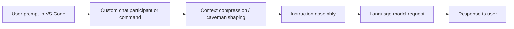

## <!-- markdownlint-disable-file -->

## description: Research on VS Code and GitHub Copilot extension capabilities for prompt interception and compression

# Task Research: VS Code Copilot Message Interception

Research whether a VS Code extension can intercept messages before they are sent to GitHub Copilot, compress developer context automatically, and inject a specialized prompt strategy such as `caveman`.

## Task Implementation Requests

- Determine which VS Code extension APIs exist for chat, language models, prompt files, and agent-style workflows.
- Determine whether GitHub Copilot chat traffic can be intercepted or modified by a third-party extension.
- Identify the closest supported architecture for automatic context compression and prompt shaping.

## Executive Answer

Direct interception of built-in Copilot chat messages is not supported by public VS Code extension APIs. The supported route is to own the interaction yourself through a custom chat participant or prompt-driven workflow, compress context before composing the request, and then send that request to the model from your own code.

If the goal is fully automatic compression, a custom chat participant is the best fit. Prompt files and commands are supported, but they are manual entry points rather than a pre-send hook for built-in Copilot chat.

## Scope and Success Criteria

- Scope: VS Code extension capabilities, GitHub Copilot integration boundaries, and implementation patterns that can approximate prompt interception.
- Assumptions: The goal is to improve developer message efficiency without relying on unsupported private APIs.
- Success Criteria:
  - Confirm whether direct interception of Copilot messages is supported or blocked.
  - Document supported alternatives with clear trade-offs.
  - Provide a recommended implementation path for ENGRAM.

## Outline

- Research VS Code APIs relevant to chat and language models.
- Research GitHub Copilot extensibility boundaries.
- Compare direct interception against supported alternatives such as custom chat participants, commands, prompt files, or agent flows.
- Select the safest supported approach.

## Potential Next Research

- Clarify whether VS Code provides any pre-send hook for built-in Copilot chat.
  - Reasoning: This determines whether the requested behavior is possible directly or only approximated.
  - Reference: VS Code extension API documentation and Copilot docs.
- Research chat participant and language model provider APIs.
  - Reasoning: These are the most likely supported extension points for message shaping.
  - Reference: VS Code API docs.

## Research Executed

### File Analysis

- README.md
  - Local setup confirms the repository is a TypeScript monorepo with an MCP server and multiple packages.
- packages/embeddings/src/embeddings.module.ts
  - Embeddings are selected through an injected provider token and environment flag switch, which matches an explicit-extension-point pattern rather than hidden interception.
  - Evidence: packages/embeddings/src/embeddings.module.ts:15-42.
- packages/memory-stm/src/memory-stm.service.ts and packages/memory-ltm/src/memory-ltm.service.ts
  - Existing memory workflows tolerate missing embedding providers and keep memory creation working even when embeddings are unavailable.
  - Evidence: packages/memory-stm/src/memory-stm.service.ts:38-84 and packages/memory-ltm/src/memory-ltm.service.ts:63-105.
- apps/mcp-server/src/health/pgvector.health.ts
  - Health indicators already distinguish applicable versus non-applicable backend behavior.

### Code Search Results

- Not needed after the subagent verified the relevant VS Code APIs and Copilot extensibility boundaries.

### External Research

- Subagent research note: .copilot-tracking/research/subagents/2026-06-02/vscode-copilot-interception-research-subagent.md
  - No public pre-send interception hook exists for built-in Copilot chat. See lines 16-30 and 129-134.
  - Chat participants can only shape their own workflow, not rewrite another participant's or Copilot's request. See lines 27-42.
  - Custom instructions influence prompt construction, but they are not an interception API. See lines 49-55.
  - Prompt files and chat participants are the supported extensibility surfaces. See lines 61-67 and 120-127.
  - Commands and command URIs can launch behavior, but they do not intercept in-flight Copilot messages. See lines 74-79.
  - GitHub App extensibility exists, but it is a separate supported surface, not a local request-interception hook. See lines 85-93.

### Project Conventions

- Standards referenced: root README setup guidance, AGENTS.md, CLAUDE.md, and repo memory notes.
- Guidelines followed: markdown frontmatter, concise scope statements, and research-note structure under .copilot-tracking/research/.

## Key Discoveries

### Project Structure

ENGRAM is already structured around explicit module selection, optional providers, and injectable behavior. That makes a participant-owned prompt pipeline the best conceptual match for a VS Code solution.

### Implementation Patterns

The codebase already uses injectable providers and tokens to select behavior. A VS Code extension should follow the same shape: own the request surface, compress context before the model call, and keep the compression logic behind a clear extension point.

### API and Schema Documentation

Verified VS Code surfaces from the subagent research:

- `vscode.chat.createChatParticipant(...)`
- `ChatRequestHandler`
- `ChatRequest.prompt`
- `ChatContext.history`
- `vscode.lm.selectChatModels(...)`
- `LanguageModelChatMessage.User(...)` and `LanguageModelChatMessage.Assistant(...)`
- `vscode.commands.registerCommand(...)`
- `vscode.commands.executeCommand(...)`
- `contributes.chatParticipants`
- `contributes.chatPromptFiles`
- `contributes.commands`

Supported docs from the subagent research:

- VS Code chat guide: https://code.visualstudio.com/api/extension-guides/ai/chat
- VS Code chat API reference: https://code.visualstudio.com/api/references/vscode-api#chat
- VS Code language model guide: https://code.visualstudio.com/api/extension-guides/ai/language-model
- VS Code language model API reference: https://code.visualstudio.com/api/references/vscode-api#lm
- Custom instructions guide: https://code.visualstudio.com/docs/agent-customization/custom-instructions
- Prompt files guide: https://code.visualstudio.com/docs/agent-customization/prompt-files
- Commands guide: https://code.visualstudio.com/api/extension-guides/command

### Configuration Examples

The repo already exposes its own always-on instruction files and provider toggles, which suggests the safest extension design should also rely on explicit configuration instead of interception:

```text
.github/copilot-instructions.md
AGENTS.md
*.instructions.md
EMBEDDING_PROVIDER
DEFAULT_EMBEDDING_PROVIDER
```

### Complete Examples



```typescript
// Pseudocode for the supported pattern, not a direct Copilot interception hook.
const compressed = compressContext(request.prompt, request.context.history);
const prompt = buildPrompt({ mode: 'caveman', compressed });
await model.sendRequest([LanguageModelChatMessage.User(prompt)]);
```

## Technical Scenarios

### Direct interception of Copilot chat messages

Investigate whether any public VS Code API allows an extension to see, rewrite, or block the message before it is sent to GitHub Copilot.

**Requirements:**

- Preserve user intent while reducing prompt length.
- Avoid relying on private or unstable internal APIs.
- Work with the existing Copilot chat experience if supported.

**Preferred Approach:**

- Reject this approach. The subagent verified there is no public pre-send interception hook for built-in Copilot chat, and no public API to rewrite another participant's message in flight.

```text
Why rejected: .copilot-tracking/research/subagents/2026-06-02/vscode-copilot-interception-research-subagent.md:16-30, 129-134
```

**Limitations:**

- Unsupported by public APIs.
- Would require private or unstable internals.
- Risks breaking when VS Code or Copilot changes.

#### Considered Alternatives

- Custom chat participant owned by the extension.
- Prompt file or command-driven workflow.
- GitHub App-based Copilot extensibility for cross-surface behavior.

### Extension-owned chat participant with automatic compression

This is the recommended architecture when the goal is automatic prompt shrinking.

**Requirements:**

- Capture the user prompt at a supported entry point.
- Compress history, references, and surrounding context before model submission.
- Inject a consistent instruction block such as `caveman` shaping.
- Keep the implementation in a clear participant-owned workflow.

**Preferred Approach:**

- Implement a custom chat participant using `vscode.chat.createChatParticipant(...)` and `ChatRequestHandler`.
- Use `ChatRequest.prompt` and `ChatContext.history` to build a compact prompt.
- Send the request through the language-model API or participant-owned request flow.
- Add project-wide guidance through `.github/copilot-instructions.md`, `AGENTS.md`, or targeted `*.instructions.md` files as supplements, not as interception hooks.

```text
Why selected:
* Supported by public APIs
* Works for automatic compression
* Matches the repo's explicit-provider pattern
* Avoids private Copilot internals
```

**Implementation Details:**

The participant should own three stages: gather the chat input, compress it, and compose the final model request. The compression step can apply a token budget, trim repeated context, and convert long developer prose into a shorter instruction set. If the team wants a `caveman` mode, that should be a deterministic transformation inside this owned workflow, not a hidden patch to built-in Copilot.

#### Considered Alternatives

- Prompt files are useful when the workflow is manual and reusable, but they do not automatically intercept every message.
- Commands and command URIs are useful launchers, but they are invocation surfaces rather than request-rewrite surfaces.
- Custom instructions improve baseline behavior, but they do not provide a pre-send hook.

### Prompt file or command-driven workflow

This is the simplest supported alternative if the team can accept a manual trigger.

**Requirements:**

- Reusable prompt structure.
- Optional compression rules.
- User-triggered invocation.

**Preferred Approach:**

- Contribute `chatPromptFiles` for reusable slash-command style prompts.
- Contribute commands that open the participant or prompt workflow.

**Why not selected:**

- The user asked for automatic interception, not a manual prompt launcher.
- It is supported, but it does not satisfy the strongest version of the requirement.

## Recommended Approach

Build a VS Code extension that owns the chat surface through a custom chat participant, then compresses and reshapes the prompt before model submission. Treat `.github/copilot-instructions.md`, `AGENTS.md`, and scoped `*.instructions.md` files as supporting configuration, not interception points.

## Next Research

- Compare Chat Debug and agent logs against the programmable APIs to separate diagnostics from extensibility.
- Draft the actual extension package contributions for `chatParticipants`, `chatPromptFiles`, and commands.
- If cross-surface behavior matters, research the GitHub App Copilot extensibility path in more depth.
