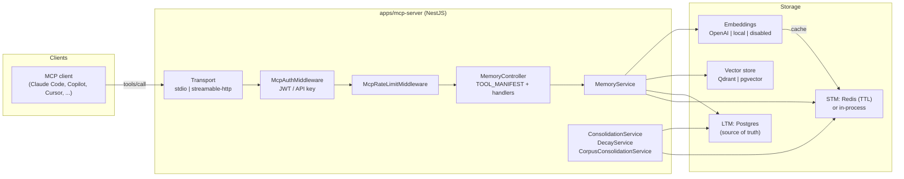

Engram is a NestJS application (`apps/mcp-server`) that speaks the Model
Context Protocol on one side and drives a small set of storage services on the
other. Every capability — storing, recalling, consolidating, decaying,
reindexing — is exposed as an MCP tool, and every tool boils down to the same
pipeline: **validate input with a strict Zod schema → resolve the acting
tenant → call a service → persist to Postgres (source of truth) and derived
indexes**.

The pages in this section explain *why* the system is shaped the way it is.
For operational steps, see the [how-to guides](/docs/how-to/); for exact tool
and variable listings, the [reference](/docs/reference/).

## System diagram

*(Mermaid source — renders as a diagram on GitHub and in Mermaid-aware
viewers.)*

## The load-bearing decisions

**Postgres is the source of truth; everything else is derived or ephemeral.**
Long-term memories live in the single `Memory` table
([memory model](/docs/architecture/memory-model/)). The vector index can be
rebuilt from Postgres at any time
([reindex & backfill](/docs/architecture/reindex-backfill/)), and short-term
memories are deliberately allowed to expire
([memory tiers](/docs/architecture/memory-tiers/)). This ordering means a lost
Qdrant volume or flushed Redis is an inconvenience, never data loss.

**One binary, three deployment profiles.** The same server runs with zero
external services (`memory`), a single encrypted local store (`lite`), or the
full Postgres + Redis + Qdrant stack (`enterprise`). Modules are wired
conditionally from `ProfileCapabilities`, and the MCP tool list itself is
filtered by profile — a profile never advertises a tool it cannot serve
([deployment profiles](/docs/architecture/deployment-profiles/)).

**Degrade, don't fail.** Embeddings are optional at every seam: if the
provider is disabled or unreachable, writes still succeed (vector-less) and
recall falls back to what is available
([embeddings](/docs/architecture/embeddings/),
[vector backends](/docs/architecture/vector-backends/)).

**The tenant boundary is the credential, not the request body.** With auth
enabled, the verified key's `userId` overrides anything the client sends, and
a multi-tenant HTTP server refuses to boot unauthenticated in every
`NODE_ENV` ([auth & multi-tenancy](/docs/architecture/auth-and-multitenancy/)).

**Background jobs must never clobber a concurrent edit.** Every lifecycle
mutation — decay, dedup annotation, contradiction marking, corpus
consolidation — goes through version-guarded compare-and-set writes
([consolidation & decay](/docs/architecture/consolidation-and-decay/),
[concurrency policy](/docs/reference/concurrency-policy/)).

## Section map

| Page | Explains |
| ---- | -------- |
| [Memory model](/docs/architecture/memory-model/) | The `Memory` row, its metadata JSON, versioning, and the supporting tables |
| [Memory tiers](/docs/architecture/memory-tiers/) | STM vs LTM, TTLs, access counting, promotion |
| [Deployment profiles](/docs/architecture/deployment-profiles/) | memory / lite / enterprise and `ProfileCapabilities` |
| [Vector backends](/docs/architecture/vector-backends/) | Qdrant vs pgvector, and the in-process hybrid fallback |
| [Embeddings](/docs/architecture/embeddings/) | Providers, Redis caching, null-safe degradation |
| [Reindex & backfill](/docs/architecture/reindex-backfill/) | Cursor-resumable rebuilds, the job queue |
| [Auth & multi-tenancy](/docs/architecture/auth-and-multitenancy/) | Boot fail-safe, per-agent keys, scopes, delegation |
| [Consolidation & decay](/docs/architecture/consolidation-and-decay/) | STM→LTM promotion, corpus consolidation, dedup, contradictions |
